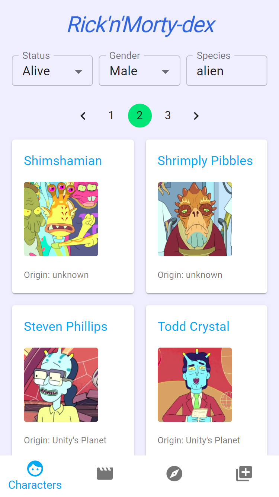

<div style="text-align: center;">
  
</div>

### Libraries used:

- React with TypeScript
- React-Router
- Material-UI

## Install packages

```
npm i
```

## Run in development mode...

```
npm run dev
```

## ...or run builded...

```
npm run build
npm install -g serve
serve -s build
```

## ...or maybe open on [codesandbox](https://codesandbox.io/s/github/dyefim/rick-n-morty-dex)
